IP addresses and subnet masks are binary (1s and 0s) and each subnet needs a certain number of bits for hosts. The formula is shown below, however subtracting 2 for the network and broadcast address:  

The subnet mask is a 32-bit number used to divide an IP address into the network part and the host part.
For each of the 6 subnets given in this lab guide
 I will be showing the IP allocation of each subnet and the subnet masking.

 Subnet1: Finance (50 hosts)

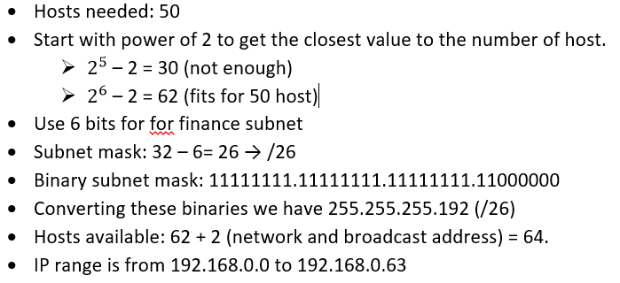

Subnet2: Human Resources (30 hosts)

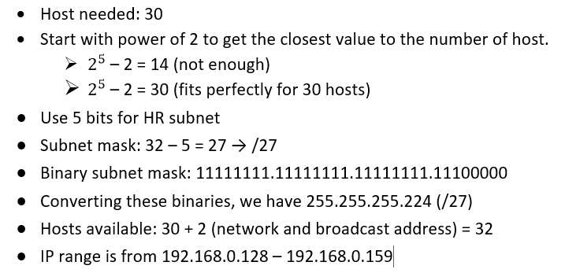

Subnet3: Sales (70 hosts)

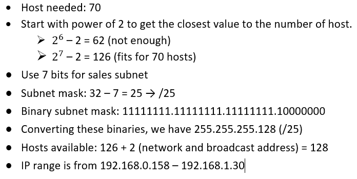

Subnet4: Marketing (40 hosts)

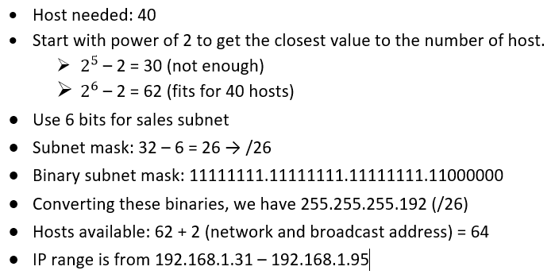

Subnet5: IT (100 hosts)

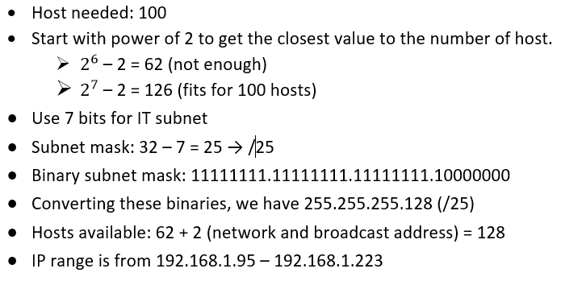

Subnet6: Operations (80 hosts)

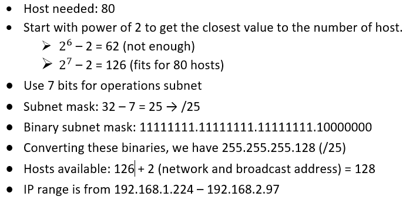

The documentation is shown in the table below:

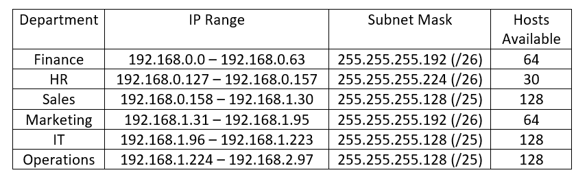

Future Growth:

Expanding existing subnets and also adding new subnet. I will be expanding both the finance and operations department. And then i will be adding a new subnet for the legal department. The legal department is not a large department, it only comprises of 20 available hosts.

I will expand finance department from 64 to 120 available host. And also the operations departmnet from 80 to 110 hosts.

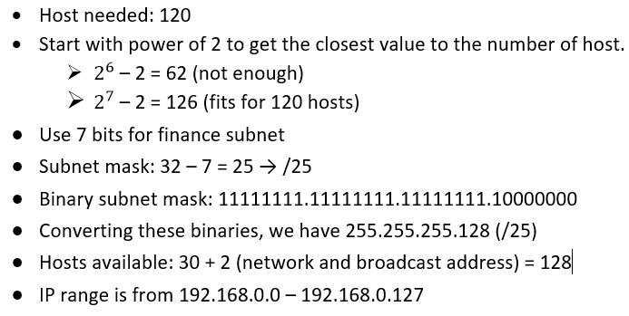

Adding a new subnet, Legal department

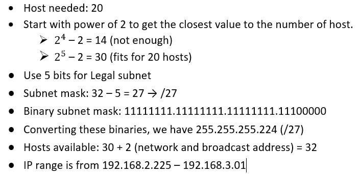

New documentation after expansions and legal subnet addition

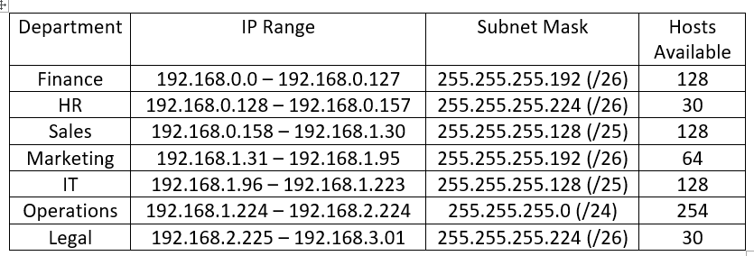

Subnet Allocation Visualization

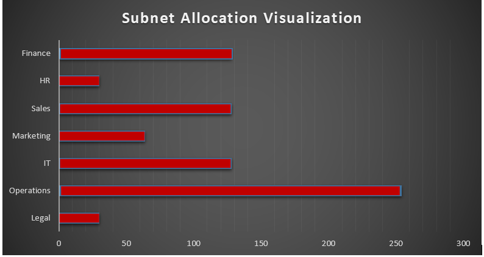